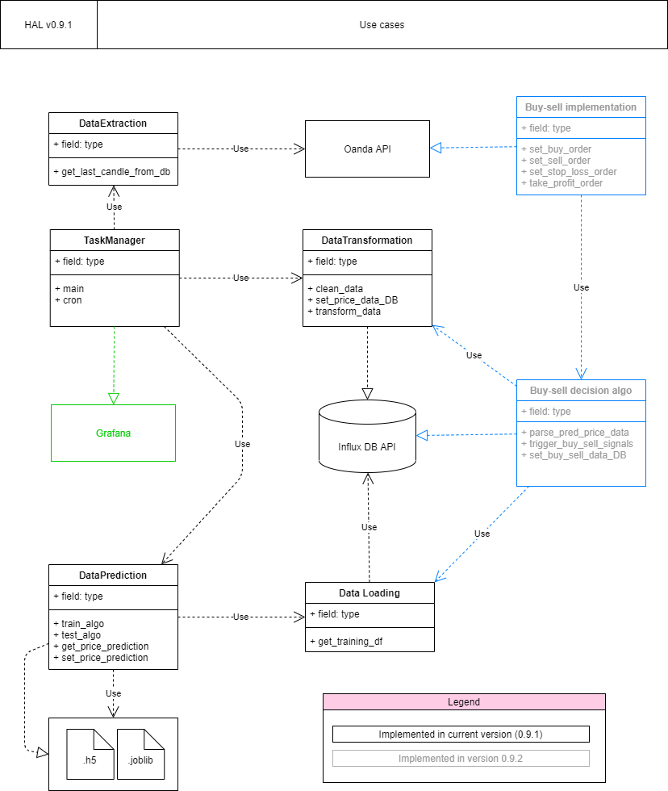
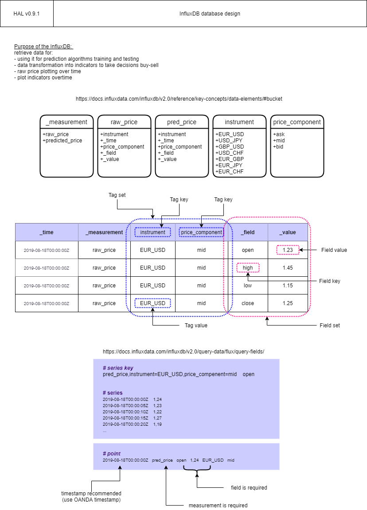

# HAL (draft)

## INTRODUCTION
HAL is a demo project that trades Forex using a 60 seconds scalping strategy based on the prediction of price time series 4 minutes in anticipation. The predictor uses a Long Short Term Memory deep learning technique. The price data is read from a broker called Oanda. Finally the transformed data and predicted data is saved into  INflux Database. All the above is organized in an ETL structure.

This is a training project with two goals. The first one is to train myself in Python, using Pandas, Numpy and ScikitLearn. The second one is to show potential recruiters what is my level as a python programmer. The final intention of publishing this project is to get a job as a Data Engineer so I could boost my learning path.

## TECHNOLOGIES
Python 3.8

## LAUNCH
Pending from first commit to master branch

## ARCHITECTURE
Use cases: 

Database design:

